# TinyRasterizer

A tiny real-time rasterizer, totally three-pass, first pass for screen space ambient occlusion, second pass for shadow map, third pass for final rendering.

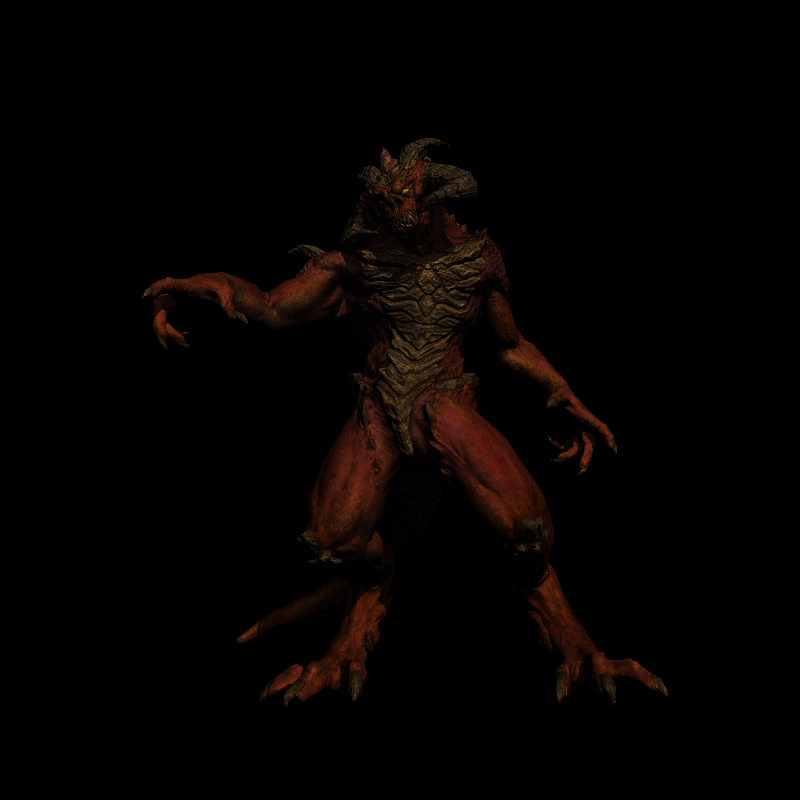

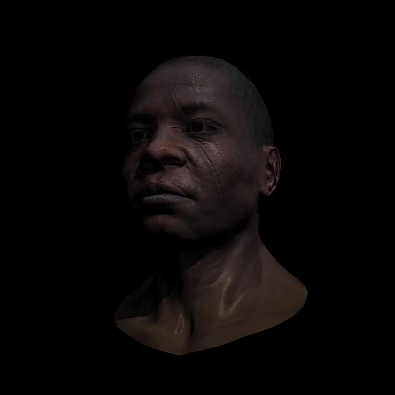

### Features implemented:

Bresenham's Line Drawing Algorithm

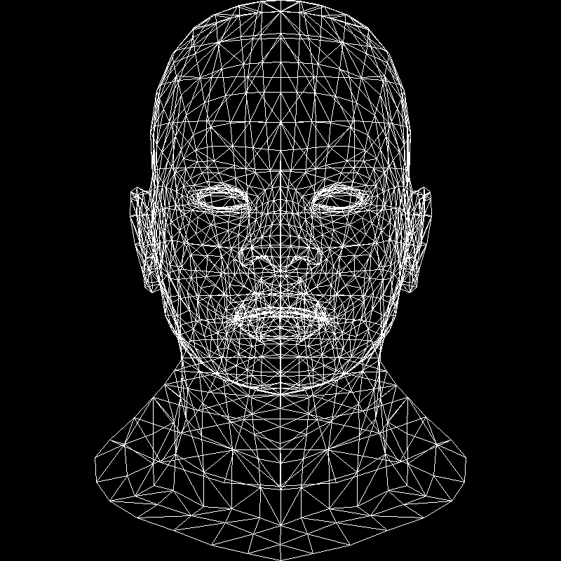

Triangles Rasterization

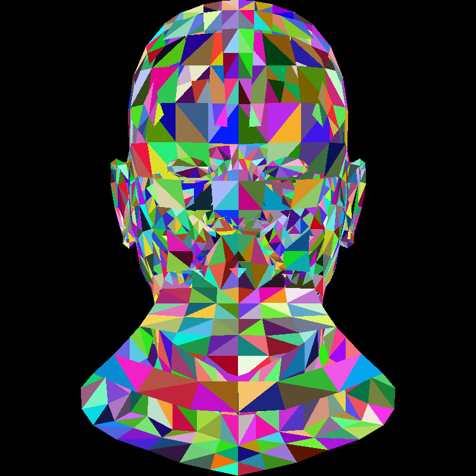

Perspective Projection

Moving Camera

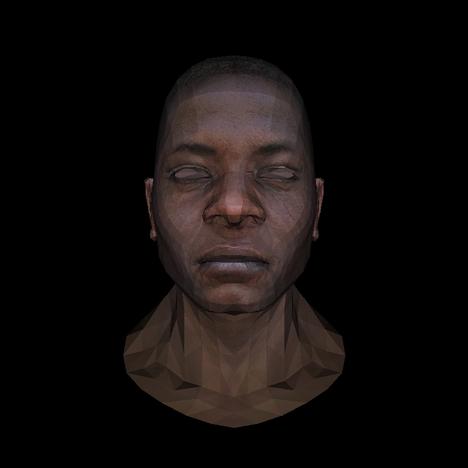

Z-buffer

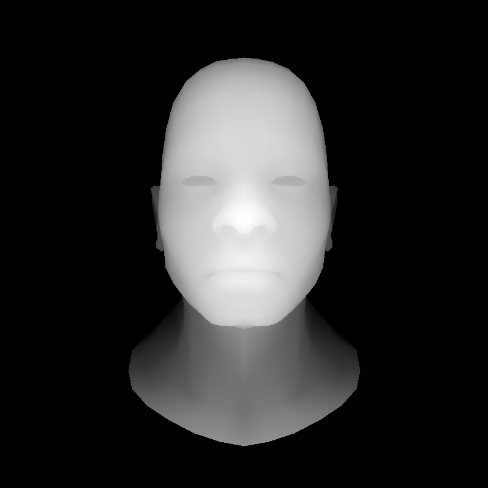

Shading: 
  * Flat shading

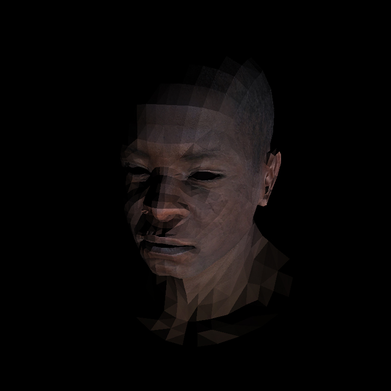

  * Gouraud shading

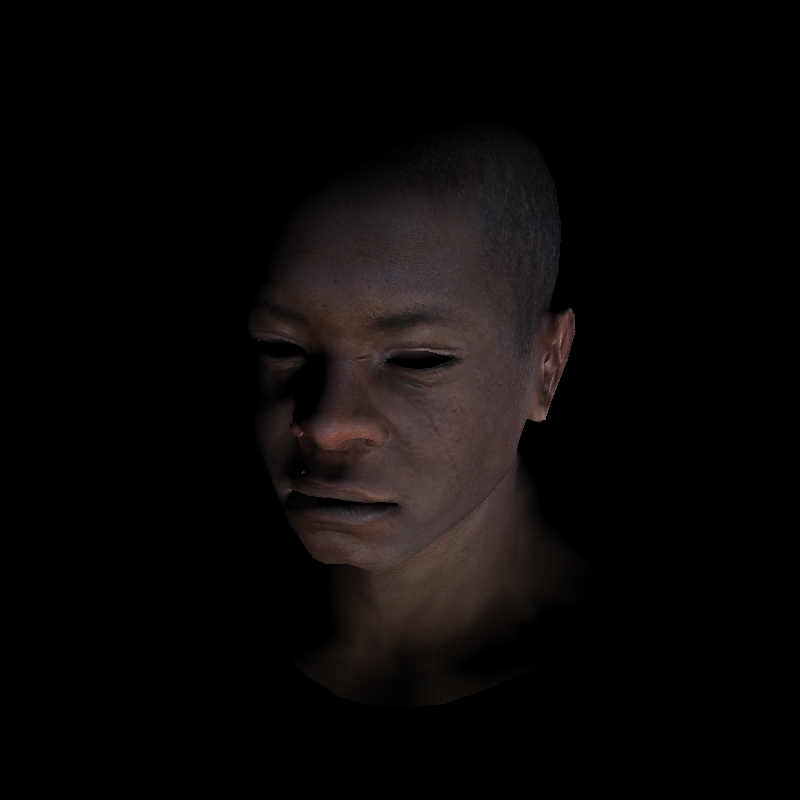

  * Blinn-Phong shading

Shader pipeline

Map:
* Texture

* Global Normal

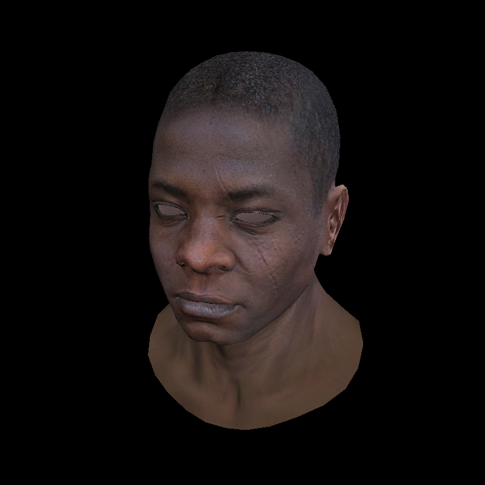

  * Tangent Normal

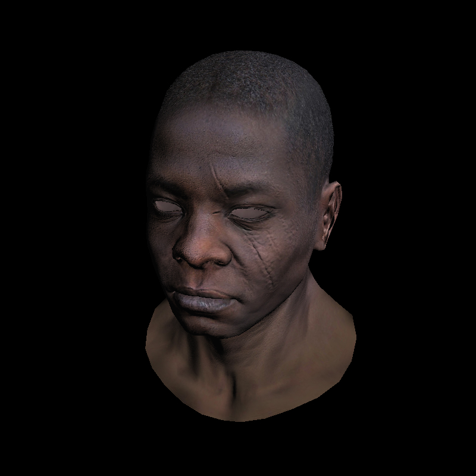

* Specular

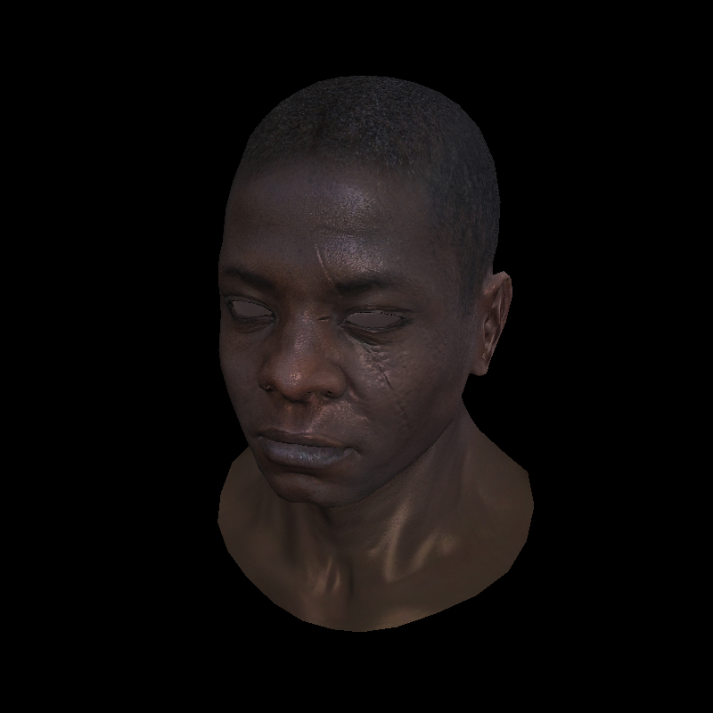

Shadow Mapping
* two pass

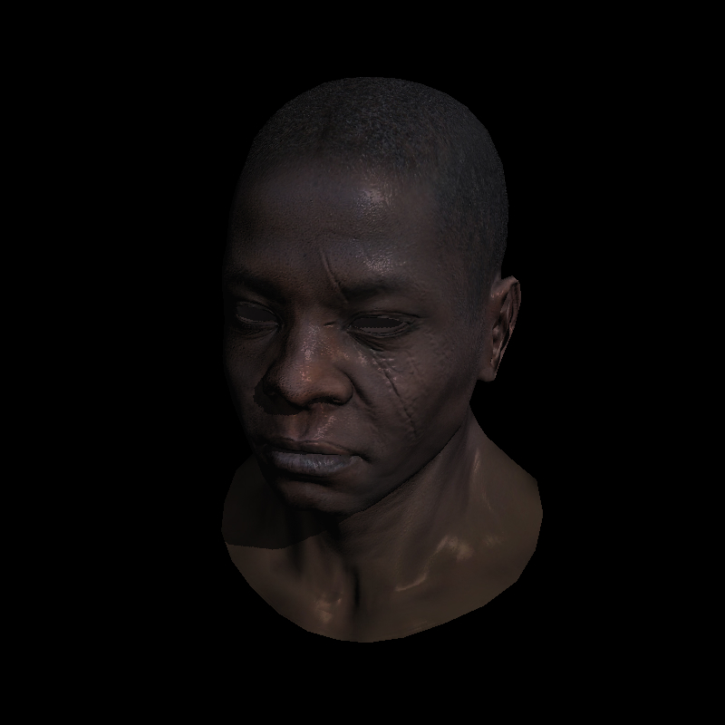

Ambient Occlusion

* screen space based

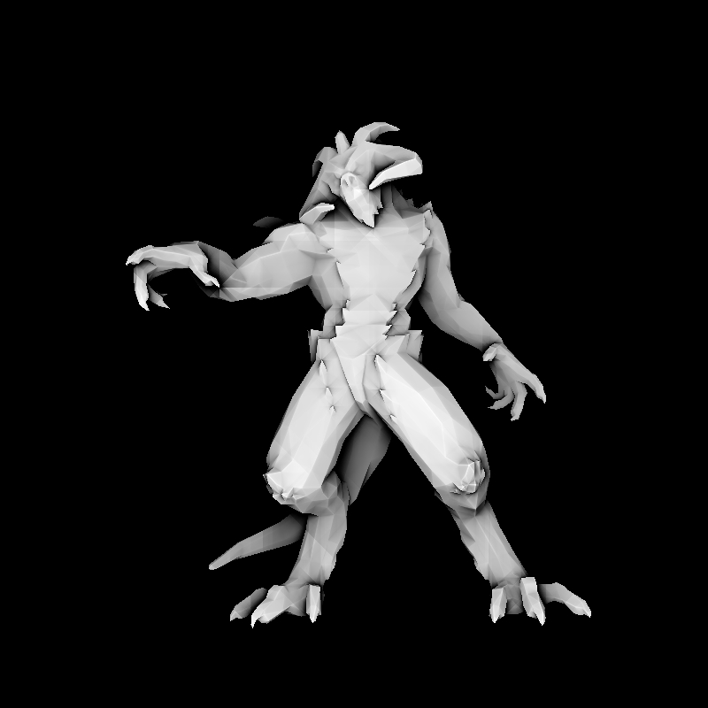
